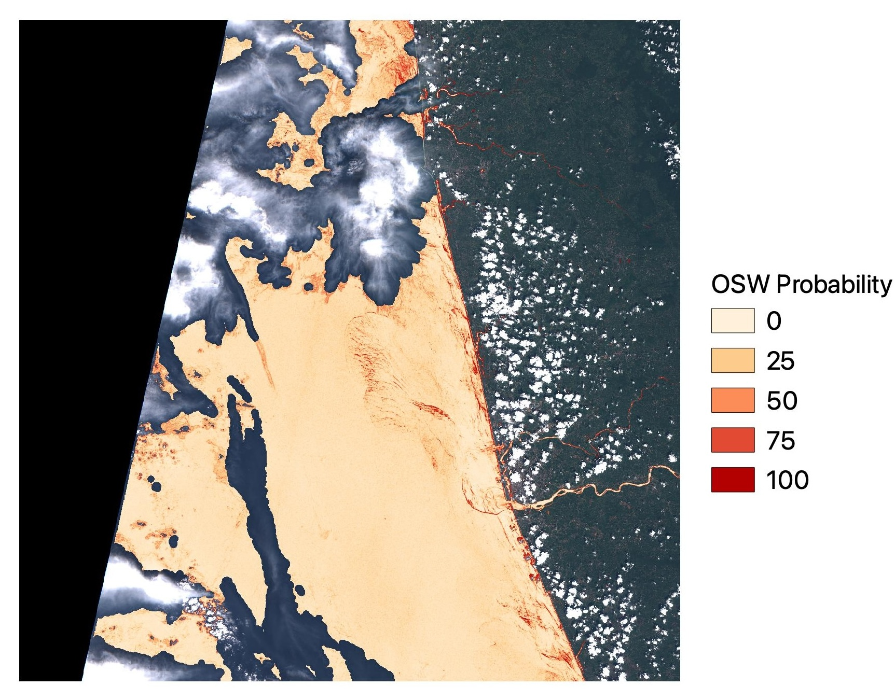

# Optically-Shallow-Deep 

This python tool delineates optically shallow and deep waters in Sentinel-2 imagery. The tool uses a deep neural network (DNN) that was trained on a diverse set of global images.

Supported input includes Level-1C (L1C) SAFE files and ACOLITE-processed L2R netCDF files. The output geotiff contains probabilities of water pixels being optically shallow and deep. 

**Home page:** <a href="https://github.com/yulunwu8/Optically-Shallow-Deep" target="_blank">https://github.com/yulunwu8/Optically-Shallow-Deep</a>

**Publication:** Richardson, G., Foreman, N., Knudby, A., Wu, Y., & Lin, Y. (2024). Global deep learning model for delineation of optically shallow and optically deep water in Sentinel-2 imagery. *Remote Sensing of Environment*, 311, 114302. <a href="https://doi.org/10.1016/j.rse.2024.114302" target="_blank">https://doi.org/10.1016/j.rse.2024.114302</a>

Originally coded by G. Richardson and A. Knudby, modified and packaged by Y. Wu

Models trained by G. Richardson and N. Foreman

 
## Installation 

**1 - Create a conda environment and activate it:**

```bash
conda create --name opticallyshallowdeep python=3.10
conda activate opticallyshallowdeep
```

**2 - Install tensorflow**

For mac OS: 

```bash
conda install -c apple tensorflow-deps
python -m pip install tensorflow-macos
```


For Windows and Linux:

```bash
pip3 install tensorflow==2.13.0
```


More on installing tensorflow: [https://www.tensorflow.org/install](https://www.tensorflow.org/install)


**3 - Install opticallyshallowdeep:**

```bash
pip3 install opticallyshallowdeep
```


## Quick Start

For L1C files: 

```python
import opticallyshallowdeep as osd

# Input file 
file_L1C = 'folder/S2.SAFE' 

# Output folder 
folder_out = 'folder/test_folder_out'

# Run the OSW/ODW classifier 
osd.run(file_L1C, folder_out)
```

For ACOLITE  L2R files: 

```python
import opticallyshallowdeep as osd

# Input files 
file_L1C = 'test_folder_in/S2.SAFE' 
file_L2R = 'test_folder_in/L2R.nc' 

# Output folder 
folder_out = 'folder/test_folder_out'

# Run the OSW/ODW classifier 
osd.run(file_L1C, folder_out, file_L2R=file_L2R)
```

The L1C file is always required as it contains a built-in cloud mask. Pixels within 8 pixels of the cloud mask are masked to reduce the impact of clouds. 


Output is a 1-band geotiff, with values of prediction probability of optically shallow water (OSW): 100 means most likely OSW, 0 means most likely optically deep water (ODW). Non-water pixels are masked. It is recommended to treat pixels between 0 and 40 as ODW, and pixels between 60 and 100 as OSW (Richardson et al., 2024).

A log file, an intermediate multi-band geotiff, and a preview PNG are also generated in the output folder. They can be deleted after the processing. 


**Sample Sentinel-2 scene and output:**





## Tips 

Users have reported that averaging results from multiple images acquired on different days can help reduce noise and improve the overall accuracy of classification results.


## Training, test, and validation data 

All annotated shapefiles used in training, testing, and validating the DNN model are in the annotated_shapefiles folder, grouped by Sentinel-2 Scene ID.


